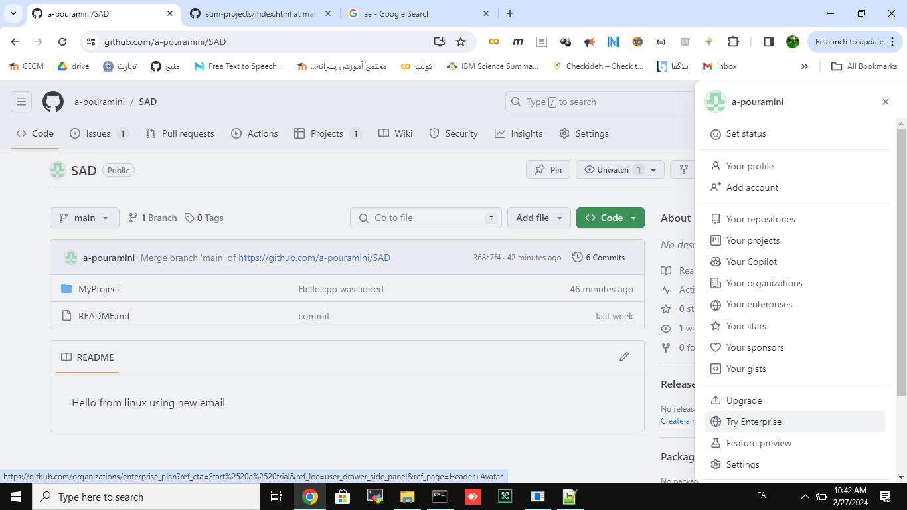

ایجاد حساب کاربری
=================

به سایت github.com رفته و حساب کاربری ایجاد کنید.


برقراری احراز هویت
==================

در محیط cmd ویندوز دستور زیز را اجرا کنید.

```
ssh-keygen
```

...

سپس به قسمت تنظمیات گیتهاب بروید.

